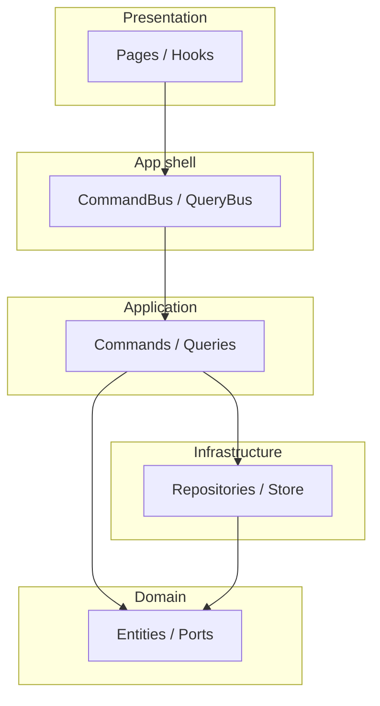

# Project Structure

This document explains the folder layout, the role of each area, and where to put new code when building features.

---

## 1. Overview

The project is a **React + Vite + TypeScript** app organized with **Clean Architecture** and **CQRS** (write/read split via Command Bus and Query Bus).

```text
clean-architecture-react/
├── docs-vi/                 # Vietnamese docs
├── docs-en/                 # English docs
├── public/                  # Static assets (favicon, MSW worker, locales, ...)
├── src/
│   ├── app/                 # App layer: router, bus, composition root, providers
│   ├── features/            # Feature slices by domain (auth, users, ...)
│   ├── shared/              # Shared UI, libs, utils, types
│   ├── config/              # Runtime/config helpers
│   ├── mocks/               # MSW handlers (dev + test)
│   ├── test/                # Vitest global setup
│   ├── styles/              # Global styles
│   ├── assets/              # Images, icons, media
│   └── main.tsx             # Entry: bootstrap + MSW + React render
├── vite.config.ts
├── tsconfig*.json
└── package.json
```

---

## 2. `src/app/`

| Path               | Responsibility                                                          |
| ------------------ | ----------------------------------------------------------------------- |
| `app/router/`      | App routes: `routes.tsx`, `ProtectedRoute`, `PermissionRoute`           |
| `app/bus/`         | `CommandBus`, `QueryBus`, pipeline behaviors, public exports            |
| `app/composition/` | Composition root: bootstrap, dependency wiring, bus module registration |
| `app/providers/`   | React providers: Query, i18n, theme, app wrapper                        |

Rule of thumb: domain/use case code should not depend on `app/` internals (except injected contracts). Presentation hooks can call `commandBus`/`queryBus` from `@/app/bus`.

---

## 3. `src/features/<feature-name>/`

Recommended feature slice layout:

```text
features/users/
├── application/
│   ├── commands/
│   ├── queries/
│   └── dtos/
├── domain/
│   ├── entities/
│   └── repositories/        # Ports/interfaces
├── infrastructure/
│   ├── repositories/        # API adapters
│   └── store/               # Optional local store
├── presentation/
│   ├── pages/
│   ├── components/
│   └── hooks/
└── bus.module.ts            # Registers command/query handlers
```

If a feature is simple UI-only (for example a static dashboard), `bus.module.ts` is optional until command/query use cases are needed.

---

## 4. `src/shared/`

- `shared/components/`: reusable layout/feedback/common components.
- `shared/lib/`: shared infrastructure (`axios`, `queryClient`, theme setup).
- `shared/hooks`, `shared/utils`, `shared/types`: generic reusable logic only.

---

## 5. `src/mocks/` (MSW)

- `handlers.ts`: HTTP handlers.
- `browser.ts`: MSW worker for browser/dev.
- `server.ts`: MSW server for tests.

Enable MSW in dev via environment variables (`.env.development`).

---

## 6. Where to place new code

| Task                        | Location                                                          |
| --------------------------- | ----------------------------------------------------------------- |
| New feature screen          | `features/<x>/presentation/pages/`                                |
| Business write/read flow    | `application/commands` or `application/queries` + `bus.module.ts` |
| Repository contract         | `domain/repositories/`                                            |
| Concrete HTTP adapter       | `infrastructure/repositories/`                                    |
| Route guards                | `app/router/routes.tsx` + `ProtectedRoute` / `PermissionRoute`    |
| Dependency injection wiring | `app/composition/types.ts` and `app/composition/AppModule.ts`     |

---

## 7. Import aliases

- `@/` -> `src/`
- `@app/*` -> `src/app/*`
- `@features/*` -> `src/features/*`
- `@shared/*` -> `src/shared/*`

---

## 8. Layer dependency summary



For detailed bus and pipeline flow, see `docs-en/02-bus-pipeline-and-application.md`.

---

## 9. Boundary import rules

Use these rules to keep each layer independent and predictable.

### 9.1 Allowed dependencies by layer

| Layer            | Can import from                                                                                  | Must not import from                                                           |
| ---------------- | ------------------------------------------------------------------------------------------------ | ------------------------------------------------------------------------------ |
| `domain`         | same-feature `domain`, `@/shared/*` (pure types/utils only)                                      | `application`, `infrastructure`, `presentation`, React/UI libraries, `@/app/*` |
| `application`    | same-feature `domain`, same-feature `application`, `@/shared/*`, `@/app/bus/types`               | `presentation` (same or other feature), direct UI/framework concerns           |
| `infrastructure` | same-feature `domain`, same-feature `infrastructure`, `@/shared/*`                               | `presentation`                                                                 |
| `presentation`   | same-feature `application`, `domain`, `infrastructure` (state adapters), `@/app/*`, `@/shared/*` | other feature internals                                                        |
| `app`            | feature public modules, `shared`                                                                 | feature internals unrelated to app composition/routing                         |
| `shared`         | other `shared` modules                                                                           | feature-specific business logic                                                |

### 9.2 Feature-to-feature boundary

- Do not import another feature's internal folders directly (for example `@/features/auth/application/...` from `users`).
- If cross-feature reuse is required, expose a stable API through that feature's `index.ts` (public surface) and import from that public entry only.
- Keep cross-feature domain coupling minimal; prefer shared contracts in `@/shared/*` when the concept is truly generic.

### 9.3 Practical conventions in this repository

- Command/query handlers live in `application`, and consume repository interfaces from `domain/repositories`.
- Concrete HTTP adapters live in `infrastructure/repositories` and implement those interfaces.
- UI hooks/pages call `commandBus` / `queryBus` through `@/app/bus`.
- Route wiring stays in `@/app/router`, while feature route definitions stay in each feature `presentation/routes`.

### 9.4 ESLint enforcement template (recommended)

Add a boundary rule set in `eslint.config.js` using `import/no-restricted-paths` and `no-restricted-imports`:

```js
{
  files: ['src/features/**/*.ts', 'src/features/**/*.tsx'],
  rules: {
    'import/no-restricted-paths': [
      'error',
      {
        zones: [
          {
            target: './src/features/*/domain',
            from: './src/features/*/{application,infrastructure,presentation}',
            message: 'Domain layer must not depend on outer layers.',
          },
          {
            target: './src/features/*/application',
            from: './src/features/*/presentation',
            message: 'Application layer must not import presentation.',
          },
          {
            target: './src/features/*/infrastructure',
            from: './src/features/*/presentation',
            message: 'Infrastructure must not import presentation.',
          },
        ],
      },
    ],
    'no-restricted-imports': [
      'error',
      {
        patterns: [
          {
            group: ['@/features/*/*'],
            message:
              'Do not import feature internals across boundaries; use feature public API.',
          },
        ],
      },
    ],
  },
}
```

Adjust patterns to your preferred strictness. If you adopt per-feature public APIs, keep them explicit and documented in each feature `index.ts`.
