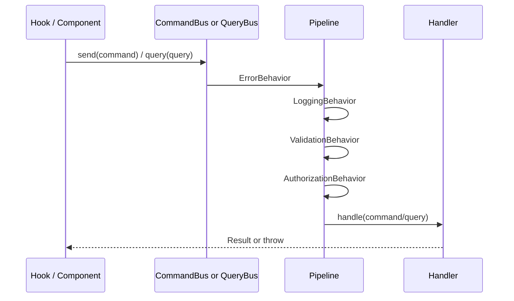

# Bus, Pipeline, and the Application Layer

This document describes how `CommandBus` / `QueryBus` work, how pipeline behaviors are chained, how handlers are registered, and team conventions for writing application-layer code.

---

## 1. Why use a Bus?

- Single entry point for use cases: `commandBus.send(...)`, `queryBus.query(...)`.
- Cross-cutting concerns (logging, validation, authorization, error normalization) live outside handlers.
- Better testability: test handlers in isolation or with selected pipeline behaviors.

---

## 2. Command vs Query (CQRS)

| Concept   | Purpose                                             | Bus API                    |
| --------- | --------------------------------------------------- | -------------------------- |
| `Command` | Change state (login, create user, update user, ...) | `commandBus.send(command)` |
| `Query`   | Read data (user list/detail, ...)                   | `queryBus.query(query)`    |

File convention:

- `features/<x>/application/commands/<Name>Command.ts`
- `features/<x>/application/queries/<Name>Query.ts`

---

## 3. Request flow



---

## 4. Pipeline order (important)

In `AppModule.ts`, behaviors are registered in this order:

1. `ErrorBehavior` (outermost wrapper)
2. `LoggingBehavior`
3. `ValidationBehavior`
4. `AuthorizationBehavior`

The chain is built with `reduceRight`, so the first behavior added is the outermost layer.

---

## 5. Behavior responsibilities

### 5.1 `ErrorBehavior`

- Catches handler/Axios errors.
- Converts to app-level errors (for consistent UI handling).

### 5.2 `LoggingBehavior`

- Dev-focused request logging (payload + execution time).

### 5.3 `ValidationBehavior`

- Reads `static schema` (Zod) on command/query classes.
- Throws on invalid payload before handler execution.

### 5.4 `AuthorizationBehavior`

- Reads `static requiredPermission` (format: `resource:action`).
- Resolves user from auth store and checks permission service.
- Throws `Unauthenticated` or `Forbidden` when needed.

---

## 6. Handler registration (no manual central list)

### 6.1 Composition root (`AppModule.ts`)

- Build repositories/adapters once.
- Attach shared pipeline to both buses.
- Register bus modules with injected dependencies.

### 6.2 Bus module loading

`import.meta.glob('../../features/**/bus.module.ts')` discovers feature modules automatically.

Each `bus.module.ts` default-exports a function that registers handlers:

```ts
export default function registerFeature({ commandBus, queryBus, deps }) {
  commandBus.register(SomeCommand, new SomeCommandHandler(deps.someRepo))
  queryBus.register(SomeQuery, new SomeQueryHandler(deps.someRepo))
}
```

When adding a new feature, no central import list is required. Only dependency wiring may need updates.

---

## 7. Application-layer coding pattern

- `Command` class implements `ICommand` with `_type = 'command'`.
- `Query` class implements `IQuery` with `_type = 'query'`.
- Optional statics:
  - `schema` for validation
  - `requiredPermission` for authorization
- Handlers focus on business flow and repository ports.
- Handlers must not import React or UI concerns.

---

## 8. Extending composition deps

When a new feature needs a new repository:

1. Define repository interface in `domain`.
2. Implement adapter in `infrastructure/repositories`.
3. Add dependency type in `app/composition/types.ts`.
4. Instantiate + pass dependency from `AppModule.ts`.
5. Consume it in feature `bus.module.ts`.

---

## 9. Presentation usage

- Hooks/components call bus APIs, not repositories directly.
- Example:
  - `commandBus.send(new SignInCommand(...))`
  - `queryBus.query(new GetUsersQuery(...))`

Avoid creating repository instances in hooks/components.

---

## 10. UI authorization

- `usePermission()` for imperative checks.
- `PermissionRoute` for route-level guard.
- Conditional rendering helpers for action-level controls.

UI guards and bus authorization should complement each other.

---

## 11. Testing suggestions

| Goal                     | Approach                                                    |
| ------------------------ | ----------------------------------------------------------- |
| Unit test handlers       | Mock repository ports and call `handler.handle(...)`        |
| Validate schema behavior | Use bus + `ValidationBehavior` with invalid commands        |
| Repository integration   | Use MSW + real adapter (`AuthRepository`, `UserRepository`) |

---

## 12. Anti-patterns to avoid

- Calling Axios directly from presentation for business flows.
- Registering duplicate handlers for the same command/query class.
- Allowing `bus.module.ts` to become too large without splitting helpers.

---

## 13. Scalability notes

- Keep one `bus.module.ts` per feature/bounded context.
- Split large use cases into multiple files under `commands/queries`.
- Add new behaviors once in `AppModule` and apply globally.
