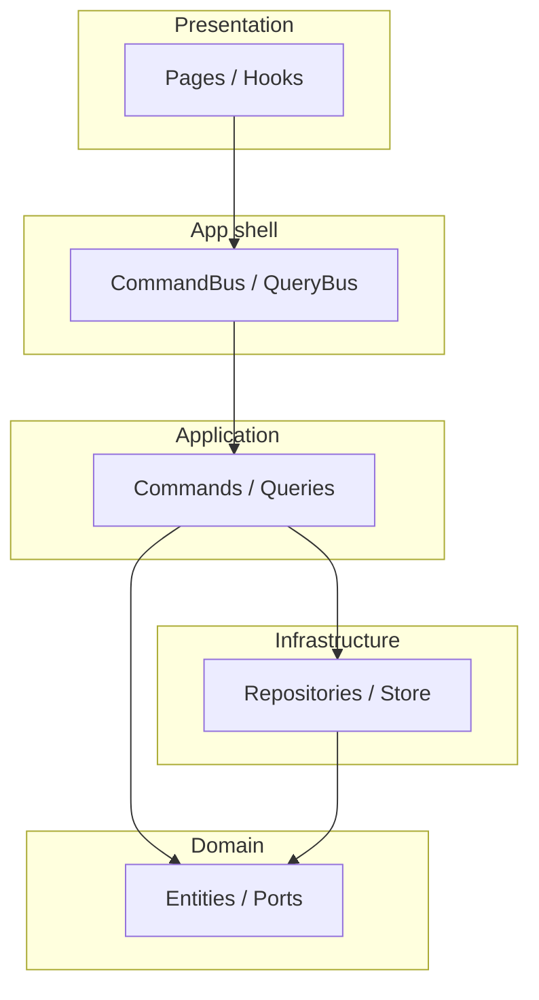

# Cấu trúc dự án (Project structure)

Tài liệu mô tả bố cục thư mục, vai trò từng phần, và quy tắc đặt file khi phát triển tính năng mới.

---

## 1. Tổng quan

Dự án là ứng dụng **React + Vite + TypeScript**, tổ chức theo **Clean Architecture** kết hợp **CQRS** (tách thao tác ghi / đọc qua Command Bus và Query Bus). Mã nguồn chính nằm trong `src/`.

```
clean-architecture-react/
├── docs/                    # Tài liệu (cấu trúc, bus, hướng dẫn team)
├── public/                  # Tĩnh (favicon, MSW worker, locales JSON nếu có)
├── src/
│   ├── app/                 # Lớp ứng dụng: router, bus, composition, providers
│   ├── features/            # Tính năng theo domain (auth, users, dashboard, …)
│   ├── shared/              # Thư viện dùng chung (UI, axios, theme, utils)
│   ├── config/              # Cấu hình (env helpers, …)
│   ├── mocks/               # MSW (dev + test)
│   ├── test/                # Setup Vitest
│   ├── styles/              # CSS toàn cục
│   ├── assets/              # SVG, hình ảnh
│   └── main.tsx             # Entry: bootstrap bus + MSW + React
├── vite.config.ts
├── tsconfig*.json
└── package.json
```

---

## 2. Thư mục `src/app/`

| Đường dẫn | Vai trò |
|-----------|---------|
| `app/router/` | Định nghĩa route: `routes.tsx`, `ProtectedRoute`, `PermissionRoute` |
| `app/bus/` | **CommandBus**, **QueryBus**, `types`, pipeline behaviors, export công khai (`index.ts`) |
| `app/composition/` | **Composition root**: `AppModule.ts` (bootstrap), `registerFeatureBusModules.ts`, `types.ts` (deps), `permissionService.ts` |
| `app/providers/` | React providers: Query, i18n, theme, `AppProviders` |

**Nguyên tắc:** Domain và use case **không** import trực tiếp từ `app/` trừ khi là interface được inject (ví dụ port). Hooks presentation **được** import `commandBus` / `queryBus` từ `@/app/bus`.

---

## 3. Thư mục `src/features/<ten-feature>/`

Mỗi feature nên theo cùng một “lát” (slice):

```
features/users/
├── application/
│   ├── commands/          # Command + Handler (ghi / thay đổi trạng thái)
│   ├── queries/           # Query + Handler (đọc dữ liệu)
│   └── dtos/              # DTO / schema form nếu cần
├── domain/
│   ├── entities/          # Entity, value object
│   └── repositories/    # Interface (port) — IUserRepository, …
├── infrastructure/
│   ├── repositories/      # Triển khai gọi API (adapter)
│   └── store/             # Zustand cục bộ feature nếu có
├── presentation/
│   ├── pages/
│   ├── components/
│   └── hooks/
└── bus.module.ts          # Đăng ký handler lên CommandBus / QueryBus (xem tài liệu bus)
```

**Feature không có bus:** Ví dụ `dashboard` chỉ UI + đọc dữ liệu tĩnh — không bắt buộc có `bus.module.ts` cho đến khi cần command/query.

---

## 4. Thư mục `src/shared/`

- `shared/components/` — Layout, feedback, common (`Can`, `LoadingSpinner`, …)
- `shared/lib/` — `axios` (apiClient), `queryClient`, theme Ant Design
- `shared/hooks/`, `shared/utils/`, `shared/types/` — Dùng chung, không chứa logic nghiệp vụ thuộc một feature cụ thể

---

## 5. `src/mocks/` (MSW)

- `handlers.ts` — Mock HTTP (login, …)
- `browser.ts` / `server.ts` — Worker (dev) / server (test)

Bật MSW trong dev bằng biến môi trường (xem `.env.development`).

---

## 6. Quy tắc đặt code mới

| Việc cần làm | Nơi đặt |
|--------------|---------|
| Thêm màn hình mới trong một feature | `features/<x>/presentation/pages/` |
| Gọi API đọc/ghi có quy tắc nghiệp vụ | `application/commands/` hoặc `application/queries/` + đăng ký trong `bus.module.ts` |
| Định nghĩa contract repository | `domain/repositories/` |
| Gọi HTTP cụ thể | `infrastructure/repositories/` |
| Thêm route có guard đăng nhập / quyền | `app/router/routes.tsx` + `ProtectedRoute` / `PermissionRoute` |
| Thêm repository vào DI | Mở rộng `AppCompositionDeps` trong `app/composition/types.ts` và tạo instance trong `AppModule.ts` |

---

## 7. Đường import gợi ý (alias)

- `@/` → `src/`
- `@app/*` → `src/app/*`
- `@features/*` → `src/features/*`
- `@shared/*` → `src/shared/*`

---

## 8. Sơ đồ phụ thuộc tầng (tóm tắt)



*Tài liệu chi tiết luồng bus và pipeline: xem `02-bus-pipeline-va-application.md`.*
