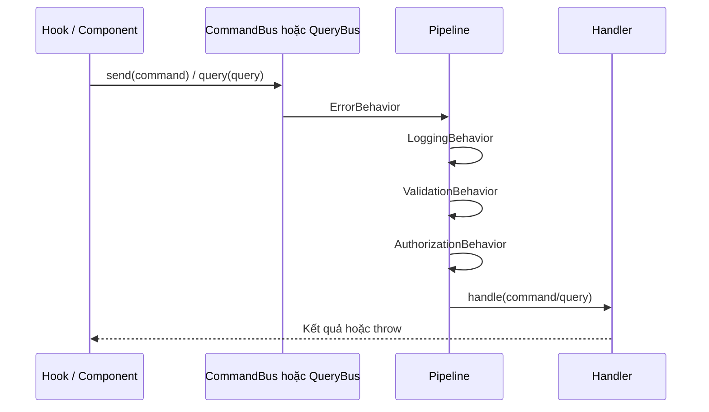

# Bus, pipeline và tầng application — Cách hoạt động & hướng dẫn team

Tài liệu giải thích **CommandBus / QueryBus**, **chuỗi pipeline**, **đăng ký handler**, và **cách team viết code** cho lớp application một cách nhất quán.

---

## 1. Tại sao có Bus?

- **Một điểm vào** cho mọi thao tác nghiệp vụ: `commandBus.send(...)` và `queryBus.query(...)`.
- **Tách cross-cutting** (log, validate, phân quyền, chuẩn hóa lỗi) khỏi từng handler.
- **Dễ test**: có thể test handler thuần hoặc test bus kèm pipeline tùy mục đích.

---

## 2. Command vs Query (CQRS)

| Khái niệm   | Mục đích                                               | Bus                        |
| ----------- | ------------------------------------------------------ | -------------------------- |
| **Command** | Thay đổi trạng thái (đăng nhập, tạo user, cập nhật, …) | `commandBus.send(command)` |
| **Query**   | Đọc dữ liệu (danh sách user, chi tiết user, …)         | `queryBus.query(query)`    |

Quy ước đặt file:

- `features/<x>/application/commands/<Ten>Command.ts` — chứa class **Command** và **Handler** cùng file (hoặc tách nếu file quá dài).
- `features/<x>/application/queries/<Ten>Query.ts` — tương tự cho Query + Handler.

---

## 3. Luồng xử lý một request (tổng quan)



---

## 4. Thứ tự pipeline (quan trọng)

Trong `AppModule.ts`, các behavior được thêm theo thứ tự:

1. **ErrorBehavior** — bọc ngoài cùng: bắt lỗi, chuẩn hóa (ví dụ Axios → `AppError`).
2. **LoggingBehavior** — log tên request, payload (dev), thời gian.
3. **ValidationBehavior** — nếu class Command/Query có `static schema` (Zod), validate trước khi vào handler.
4. **AuthorizationBehavior** — nếu có `static requiredPermission` (dạng `resource:action`), kiểm tra qua `permissionService` và `useAuthStore`.

**Cơ chế nối chuỗi:** `reduceRight` — behavior đầu tiên trong mảng là **lớp ngoài cùng** (Error bọc toàn bộ phía trong).

---

## 5. Chi tiết từng pipeline

### 5.1 `ErrorBehavior`

- Bắt lỗi từ handler hoặc từ Axios.
- Ném `AppError` (message, code, statusCode) để UI có thể hiển thị thống nhất.

### 5.2 `LoggingBehavior`

- Chủ yếu phục vụ **dev**: `console.group`, log payload, thời gian chạy.

### 5.3 `ValidationBehavior`

- Đọc `Constructor.schema` của **instance** command/query (Zod).
- `safeParse` thất bại → throw `Error('Validation failed: ...')`.

**Lưu ý:** Command/Query class không dùng parameter properties (theo cấu hình TS `erasableSyntaxOnly`); khai báo field rõ ràng trong constructor.

### 5.4 `AuthorizationBehavior`

- Đọc `static requiredPermission` trên class Command/Query, ví dụ `'users:read'`.
- Tách thành `resource` và `action`, gọi `permissionService.can(user, resource, action)`.
- Không có user → `Unauthenticated`; không đủ quyền → `Forbidden`.

Command **không** bắt buộc có `requiredPermission` (ví dụ `SignInCommand` — chưa đăng nhập).

---

## 6. Đăng ký handler — Không liệt kê tay trong AppModule

### 6.1 Composition root (`AppModule.ts`)

- Tạo **một lần** các adapter: `AuthRepository`, `UserRepository`, …
- Gắn **cùng** pipeline lên `commandBus` và `queryBus`.
- Gọi `registerFeatureBusModules({ commandBus, queryBus, deps })`.

### 6.2 `registerFeatureBusModules.ts`

- Dùng Vite: `import.meta.glob('../../features/**/bus.module.ts', { eager: true })`.
- Mỗi file `bus.module.ts` **default export** một hàm `(ctx) => void` để `.register(...)` handler.

### 6.3 `features/<ten>/bus.module.ts`

Ví dụ ý tưởng:

```ts
// Giản lược — xem file thật trong repo
export default function registerXxxBus({ commandBus, queryBus, deps }) {
  commandBus.register(SomeCommand, new SomeCommandHandler(deps.someRepo))
  queryBus.register(SomeQuery, new SomeQueryHandler(deps.someRepo))
}
```

**Thêm feature mới:** tạo `features/orders/bus.module.ts` — **không** cần sửa danh sách import trong `AppModule` (chỉ cần thêm repository vào `deps` nếu feature đó cần adapter mới — xem mục 8).

---

## 7. Application layer — Pattern code

### 7.1 Command

- Class implement `ICommand` với `readonly _type = 'command'`.
- (Tuỳ chọn) `static readonly schema = z.object({ ... })`.
- (Tuỳ chọn) `static readonly requiredPermission = 'users:create'`.
- Handler implement `ICommandHandler<Command, Result>` — chỉ chứa **nghiệp vụ + gọi repository**, không import React / Zustand.

### 7.2 Query

- Tương tự với `IQuery` và `_type = 'query'`.
- Query thường đọc qua repository; có thể gắn `requiredPermission` nếu route yêu cầu quyền.

### 7.3 Permission map (quy tắc role)

- Logic phân quyền theo role tập trung trong `PermissionService` + map (xem `features/auth/application/services/PermissionService.ts`).
- Pipeline chỉ **kiểm tra** theo `resource:action` đã khai báo trên Command/Query.

---

## 8. Mở rộng `AppCompositionDeps`

File `app/composition/types.ts` định nghĩa `AppCompositionDeps` (hiện tại: `authRepository`, `userRepository`).

Khi thêm feature cần repository mới:

1. Thêm interface adapter vào `domain` của feature đó.
2. Tạo implementation trong `infrastructure/repositories/`.
3. Khởi tạo trong `AppModule.ts` và **thêm vào object `deps`** truyền cho `registerFeatureBusModules`.
4. Trong `bus.module.ts` của feature, lấy qua `deps.tenRepository`.

Khi số lượng repository lớn, có thể nhóm `deps` theo subdomain (billing, catalog, …) thay vì một object phẳng.

---

## 9. Presentation — Gọi bus từ hook

- `useAuth`: `commandBus.send(new SignInCommand(email, password))`.
- `useUsers`: `queryBus.query(new GetUsersQuery(...))`, `commandBus.send(new CreateUserCommand(...))`.
- Dùng generic TypeScript khi cần: `commandBus.send<SignInCommand, SignInCommandResult>(...)`.

**Không** `new Repository()` trong hook — repository chỉ tạo trong composition root và inject vào handler qua `bus.module.ts`.

---

## 10. Phân quyền UI (bổ sung)

- `usePermission()` — kiểm tra `can(resource, action)`.
- `<Can do="..." on="...">` — ẩn/hiện nút.
- `PermissionRoute` — chặn route không đủ quyền.

Luồng bus và luồng UI permission **bổ sung** nhau: route guard + pipeline trên server-side command/query + ẩn nút trên client.

---

## 11. Kiểm thử (gợi ý)

| Mục tiêu                 | Cách làm                                                                                                    |
| ------------------------ | ----------------------------------------------------------------------------------------------------------- |
| Test handler đơn lẻ      | Mock `IAuthRepository` / `IUserRepository`, gọi `handler.handle(cmd)`                                       |
| Test validation          | Tạo `CommandBus` tạm, chỉ `.use(new ValidationBehavior())`, gửi command sai schema — handler không được gọi |
| Test tích hợp repository | Giữ test kiểu `AuthRepository.test.ts` (MSW + axios)                                                        |

---

## 12. Chống pattern xấu

- Đừng gọi `axios` trực tiếp từ component cho logic nghiệp vụ — đi qua command/query + repository.
- Đừng đăng ký handler trùng **cùng tên class Command** (registry dùng `command.constructor.name`).
- Tránh file `bus.module.ts` quá lớn: tách `register-commands.ts` / `register-queries.ts` trong feature rồi import vào `bus.module.ts`.

---

## 13. Khả năng mở rộng (hàng trăm / hàng nghìn use case)

- **Theo bounded context:** mỗi feature một `bus.module.ts`; bên trong chia nhỏ file.
- **Glob:** chỉ cần một `bus.module.ts` mỗi feature — không phải sửa danh sách import trung tâm khi thêm feature mới.
- **Bundle:** `import.meta.glob` với `eager: true` gom mọi module vào bundle chính; khi app cực lớn, cân nhắc lazy load theo route (nâng cao).
- **Pipeline:** thêm behavior mới (metric, trace ID, …) một lần trong `AppModule`, áp dụng cho mọi command/query.

---

_Tài liệu đi kèm: `01-cau-truc-du-an.md` (cấu trúc thư mục)._
